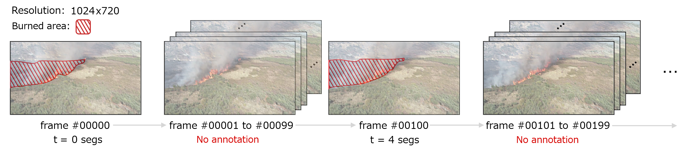
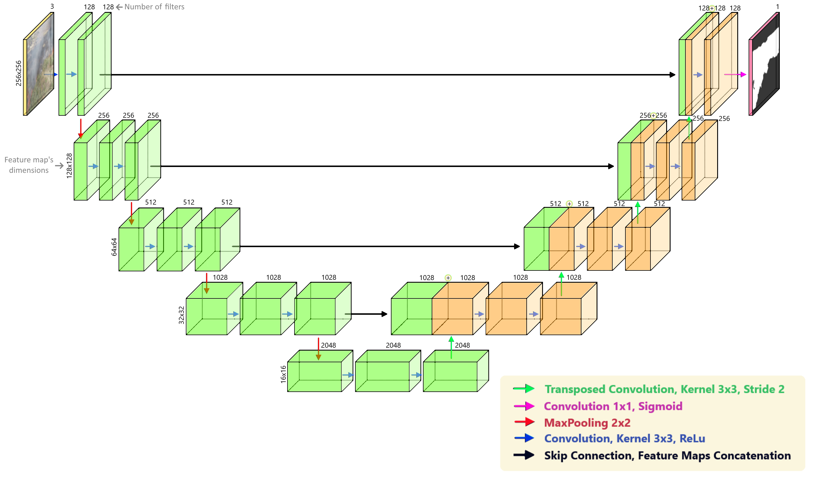
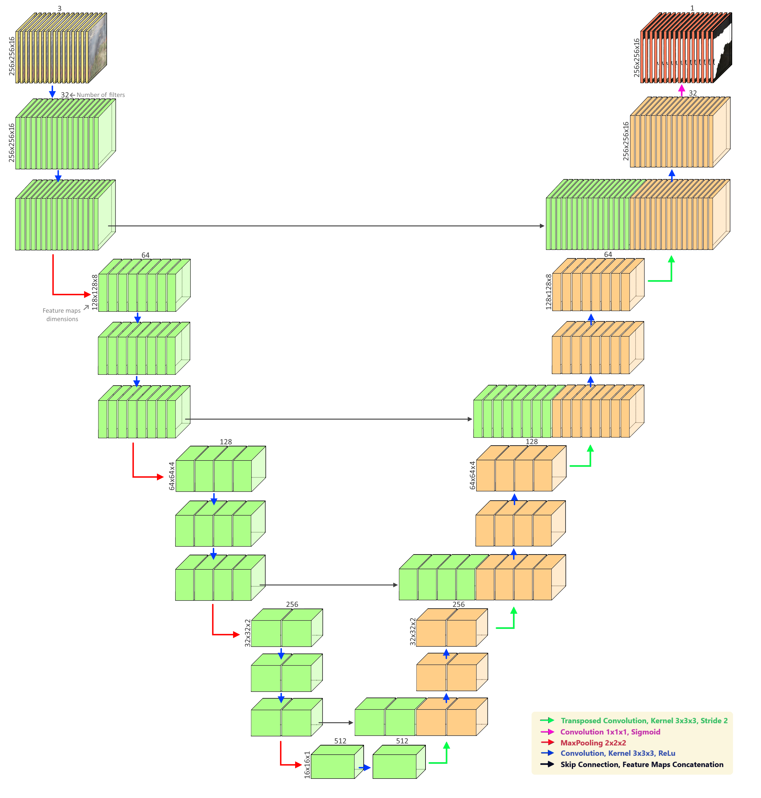
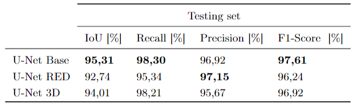
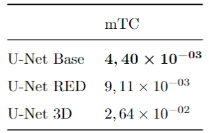
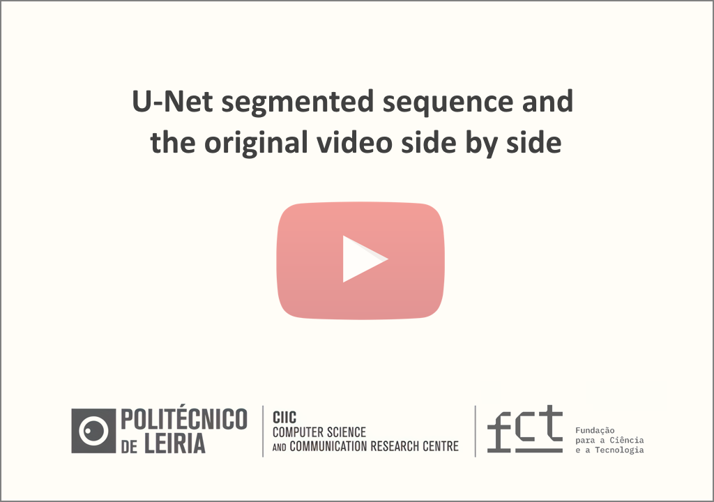

## Burned area semantic segmentation: a novel dataset and evaluation using convolutional networks
---

</center>

---


### Description

Wildfires have significant impacts on the environment, society, and economy, therefore understanding the dynamics of wildfires is crucial to evaluate such effects. Nevertheless, monitoring and measuring the burned area by traditional, non-automatic methods remains time-consuming and challenging. 

For several years, automatic semantic segmentation models have been used to describe natural phenomena, but deep learning models have recently achieved very competitive results. However, this new breed of models typically needs annotated datasets of significant dimensions. Nonetheless, datasets for real-time burnt area segmentation are often scarce.

We propose a new manually annotated dataset for segmentation of forest fire burned area based on a video captured by a UAV to train and evaluate semantic segmentation models. We explore deep learning-based techniques and establish baselines. We also suggest specific temporal consistency metrics to validate burned area polygons generated by the models. By applying U-Net network models, we obtain IoU values superior to 95\% on the test set and competitive temporal consistency compared to classical machine learning approaches in the successive frames generated by the model based on non-annotated data.

### Dataset

The dataset consists of a total of 249 frames and corresponding segmentation masks. The subset considered for training and validation contains 226 frame-mask pairs approximately 90% while the test subset contains 23 pairs approximately 10%.

 </center>

Each of the training and validation frames was generated by taking a sample every 4 seconds (corresponds to 100 frames) starting at the initial one and ending at frame 22500. The frames and annotations of the test set have the same sampling rate but are offset from the 50 frames (2 seconds) of the training and validation frames to avoid overlapping. In the case of the test frames, they start at frame 20250 and end at frame 22450, which corresponds to the final portion of the video.

### Semantic Segmentation Models

#### U-NET Base & U-Net RED Architectures

</center>

#### U-NET 3D Architecture

</center>

### Results 
</center>

</center>

<div align="center">
      <a href="https://www.youtube.com/watch?v=LvpJ7jXjSkw">
     
      </a>
 </div>

[//]: <> (### Citation

```
@article{,
    doi       = {},
    url       = {},
    year      = {},
    publisher = {},
    volume    = {},
    number    = {},
    pages     = {},
    author    = {},
    title     = {},
    journal   = {}
}

```
### License )

### Acknowledgements

This work is partially funded by [FCT - Fundação para a Ciência e a Tecnologia, I.P.](https://www.fct.pt/), through projects MIT-EXPL/ACC/0057/2021 and UIDB/04524/2020, and under the Stimulus for Scientific Employment - Institutional Support - CEECINST/00051/2018.

### Contact

If you have any questions, sugestions or want to contribute, feel free to contact me at <code>tiago.r.ribeiro@gmail.com</code>.